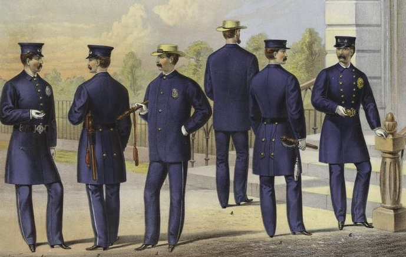
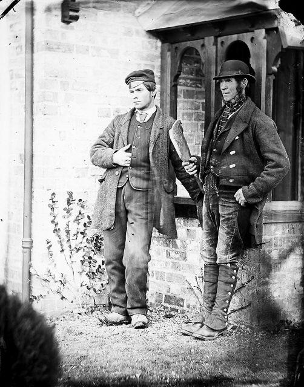

# 提线木偶

## 说明
角色：
- 警察
- 詹姆斯
- 摩根
- 德尔克
- 辛迪（黑人女仆）
- 罗伯特·钱德勒
- 艾米·钱德勒
- 群演（搬桌子）若干
- 旁白  
>负4注：  大概的警察制服参考如下（这个不太好搞，但是只要不是太出戏就好）  
> 
> 
> 几个盗贼建议穿工人的衣服（毕竟开保险箱是个体力活）（这种衣服今天也还挺常见，应该比较好搞到）
>   
> 
> 詹姆斯大概穿西装比较合适，毕竟是比较有头有脸的人物（这个简单）。  
> 艾米穿普通的衣服就好，穷人家也没有礼服（别太出戏就行，这个简单）  
> 辛迪的衣服大概是最好找的了（毕竟卖这种衣服的cosplay店家蛮多的）（只要有人愿意穿就好）  

道具：
- 场景隔板
- 桌子两张（人可以躺在上面）
- 路灯
- 黑色手提箱
- 注射器
- 棕色细口瓶
- 夹钳
- 英文旧报纸
- 钞票
- 保险箱
- 扶手椅
- 便签
- 笔  
>负4注：隔板？其实不一定需要吧（毕竟舞台这么大，不好搞）
舞台被分为左右两部分（观众视角）

## 开场
**旁白（戏谑地）** 詹姆斯、摩根和德尔克刚刚“光顾”了纺织品公司老板的办公室。什么？你说他们是强盗？不不不不，他们只不过是有副业的“正经人”。

## 第一场
**【詹姆斯站在左舞台桌子后，摩根、德尔克从左上；摩根手提黑色手提箱、德尔克在读报纸】**  
**摩根（把手提箱放在桌上，打开，数钞票）** 让我瞧瞧，一沓，两沓，这是五百。那纺织品公司的作风可真老牌，我本以为会有保险箱里万把块。  
**詹姆斯（把钱塞入大衣，用手抚摸手提箱）** 只有这点钱是令人扫兴，不过我今晚还有别的活计。（停顿，看向德尔克）德尔克，什么事令看得你如此着迷？  
>负4注：建议加几句台词，点明詹姆斯拿了830$  

**德尔克（玩笑地）** 花边新闻，老伙计。枯燥的珠宝营生得要女人的趣闻充当调剂。故事里说暴君遇上了女奴，可怜的小羊羔！她终究被主人玩戏。  
**詹姆斯（专注于细口瓶，厌恶地）** 无趣的故事。  
**摩根（玩笑地）** 把钱拿好，德尔克！詹姆斯，又有多少男人是如你一样的gentleman？“了不起的希腊人”，硝酸甘油已备妥，夹钳已就位，祝你今晚出诊一路顺风。  
**【詹姆斯将手提箱收拾好，三人从左下】**  

**【艾米坐在右舞台中央的桌子上，焦急地，辛迪在一旁安抚，罗伯从右上】**  
**罗伯特（醉酒地）** 我的骏马！你一向是制霸赛场的，而我也把钞票押注于你，你却让我败得如此彻底！输了！输麻了！我家的婆娘又会如何絮叨我？  

**【罗伯特走向右舞台中央】**  
**艾米（站起，焦急地）** 罗伯特，你又去哪里了？  
**罗伯特（含糊地）** 去了男人该去的地方。  
**艾米（焦虑地）** 你本应该早点回来。去当铺本不必花三天的时间。  
**罗伯特（搪塞地）** 我知道，你别过问了。  
**艾米（委屈地）** 罗伯特，你行行好，家里快要揭不开锅了。  
**罗伯特（不耐烦地）** 我知道，我尽力了 **（拖长音）** ，可我也没有任何办法。  
**艾米（哽咽地）** 你可翻译一下“没有办法”？我三天前可看见你带着家里的餐具出去了，你说有办法赚点现钱回来。当来的钱去哪里了？  
**罗伯特（生气地）** 没有了！灰飞烟灭了！  
**艾米（绝望愤怒地）** 让我猜猜，你拿去赌赛马了，对吧？我那个南方父亲的遗产被你输了精光，而现在讨债的人在屋外徘徊！我战战兢兢躲在房里，而你 **（顿住）** ！我真是悔了肠子与你联姻。我应该带着辛迪一走了之！  
**罗伯特（暴怒地）** 臭婆娘，闭上你的嘴！  
**【艾米转身想走，被罗伯特拽住，打在额头上，艾米倒地】**  
**辛迪（惊呼，搀扶）** 主人！  
**罗伯特（喘气，小声）** 不识好歹……这多舌的臭婆娘……  
**【艾米捂脸哭泣，罗伯特起身要走】**  
**罗伯特（愈发激烈地喘气，脸色大变）** 额，心脏好痛……  
**【罗伯特捂住胸口，倒在地上，神情狰狞】**  
**艾米（惊吓地）** 罗伯特·钱德勒！   
**【艾米伏在地上干呕】** 
**艾米（虚弱地）**	辛迪，快去请医生……  
**【艾米无力地坐在地上，辛迪惊慌从右下】**  

## 第二场
**【左舞台，大街，灯光很暗，警察站在左舞台中央，詹姆斯从左上】**  
**【右舞台灯黑，罗伯特躺到桌子上】**  
**警察（敬礼）** 晚上好，先生。请出示您的身份证明。  
**【詹姆斯无声地把名片递给警察】**  
**警察（温和地让步）** 请吧，医生。上面有令要严加盘查，因为最近发生了多起入室盗窃和拦路抢劫的案件。在这样一个夜晚出诊，可够糟糕的。天虽然不算太冷，可是湿乎乎的。**
**詹姆斯（点头）** 是的，辛苦了，警察先生。  
**【警察从左下场，詹姆斯用一手护住手提箱，来到右舞台隔板。辛迪从右舞台上，走向隔板】**  

**辛迪（自言自语地）** 钱德勒先生真是可恶，他把老爷的家产赌得精光！小姐把自己的戒指和项链卖了才勉强维持家里的生计。看在上帝的份上！小姐都遭了什么孽啊！南方的安逸生活全被这小子毁了，真希望他就此一走了之。  

**【詹姆斯敲门】**  
**辛迪（感动地）** 上帝保佑！你真是医生吗？先生？  
**詹姆斯（假笑地）** 是的，我是*医生* **（强调）** 。  
**辛迪（让步）** 那就请你看在上帝的份上，来给钱德勒先生看看病吧。他不知怎的，就发病了。现在躺在那里，跟死人一样。艾米小姐叫我请个医生，我在家里只翻到你的名片。要是老爷知道了这里的一丁点儿情况，那就有好戏看了，先生。他们肯定会掏手枪的，对，就用手枪——那里的人就用枪来说话——用步子在地上量好距离，然后决斗。哎，这样一来，可怜无助的艾米小姐该怎么……  
**詹姆斯（打断）** 如果你想要我给病人看病，你就赶快带我进去吧，我没时间听你唠叨。  

**【走入右舞台】**  
**辛迪（恭敬地）** 我找来医生了，艾米小姐。  
**【詹姆斯把医药箱放在扶手椅上，拖掉大衣，俯身去摸艾米的脉搏，艾米支起上半身】**  
>负4注：建议测量颈动脉，参见：[脉搏的测量方法](https://www.mayoclinic.org/zh-hans/how-to-take-pulse/art-20482581)  

**艾米（虚弱地睁开眼睛）** 我是钱德勒夫人，我的丈夫昏迷在那里。  

**【艾米瞥了眼丈夫身上的华服，詹姆斯顺着丈夫方向看去，点头以示了解，走到桌边】**  
**詹姆斯（自言自语）** 精致端正的五官可掩饰不住他身上冲天的酒气。这位先生可叫人捉摸不透：眉目俊秀是他，荒淫无比亦是他。  
**【拨开外套，贴近病人胸口，搜寻微弱的心跳声，起身】**  
**詹姆斯（轻声，疑问地）** 二尖瓣回流？ **（等待片刻）** 二尖瓣闭锁不全……  
**詹姆斯（朝向艾米，无奈地）** 夫人，他很可能——  
**【艾米小姐瘫在辛迪怀中，双目紧闭】**  
**辛迪（愤嚷）** 可怜的小羊羔！可怜的小羊羔！他可把我老辛迪的心肝宝贝害惨了！我家小姐就是凡间的天使啊！愿上帝开眼，让那家伙不得好死！负了她的情，伤了她的心，竟然还……  
**詹姆斯（打断）** 把她的脚抬起来。  
**【詹姆斯快步走向艾米】**  
**詹姆斯（匆忙地）** 她的房间在哪儿，必须把她抬上床。  
**辛迪（指向一扇门）** 这边，先生，那就是艾米小姐的房间。  
**【两人共同把艾米抬向左舞台桌子上，詹姆斯为她把脉】** 
**詹姆斯（起身）** 她体力透支了，睡一觉也好。等她醒来后，给她弄杯甜酒——如果能喝下的话，再敲个鸡蛋。她头上的伤怎么弄的？  
**辛迪（迟疑转愤慨)** 磕了一下，先生，那可怜的小羊羔跌了——不，先生 **（义愤填膺地）** 老辛迪才不为那恶魔撒谎，就是他干的，先生。但愿上帝叫他烂手…… **（顿住）** 哦不！辛迪答应过可爱的小羊羔绝不对别人说。艾米小姐的头只是磕了一下，先生。  
**詹姆斯（走向右舞台）** 你在这儿陪着小姐，别作声，让她好好休息。要是她醒来了，就给她喝甜酒。要是情况恶化了，就立刻来找我，这事儿有点古怪。  
**辛迪（嘟囔）** 这儿的怪事儿多了去了。  

**【詹姆斯示意噤声，到达右舞台，俯身在罗伯特身旁】**  
**罗伯特（气音）** 钱……钱……  
**詹姆斯（轻柔地）** 你能听见我说话吗？  
**【罗伯特点了点头】**  
**詹姆斯** 我是你夫人请来的医生。她告诉我，你叫钱德勒。你病得不轻，千万不要有过激反应。  
**【罗伯特示意詹姆斯凑近些，詹姆斯继续俯下身】**  
**罗伯特（虚弱地）** 钱……两万美元……  
**詹姆斯（试探地，变得兴奋起来）** 钱在哪儿？银行里？ **（喜）**   
**罗伯特（乞求地）** 告诉她 **（声音更弱）** ，两万美元……她的钱  
**詹姆斯（专注地，面露贪婪）** 你把钱藏起来了？ **（停顿）** 在这房间里？（拍打）罗伯特！罗伯特！  
**【詹姆斯思索片刻，掏出处方笺，写下药方】**  
**詹姆斯（压住欣喜激动）** 辛迪！  
**【辛迪走出房间】**  
**辛迪（恭敬地）** 医生先生，有什么吩咐吗？  
**詹姆斯（递处方）** 照着这张单子买药  
**【辛迪低头双手接过处方，走向左舞台，关上门，嘟嘟囔囔从舞台左侧下场】**  

**【詹姆斯看向左舞台】**  
**詹姆斯（自言自语地）** 艾米小姐，你还得睡上几个小时。

## 第三场
**【詹姆斯从包中取出针筒】**  
**詹姆斯（操作注射）** 向你抱歉，罗伯特先生。我必须要将这管硝酸甘油结结实实注入进你的身体。保险箱坚固的锁芯曾被同样的药水击垮，不知你脆弱的心脏将被怎样的蹂躏。  
>负4注：医学上，硝酸甘油应当静脉滴注，并使用输液泵严格控制速率。考虑到此处詹姆斯要杀人，他应该会使用注射器进行静脉注射。静脉注射的操作参见参见：[静脉注射的方法](https://baike.baidu.com/item/%E9%9D%99%E8%84%89%E6%B3%A8%E5%B0%84/6019082#:~:text=%E9%9D%99%E8%84%89%E6%B3%A8%E5%B0%84%20%EF%BC%88Intravenous%20injection%EF%BC%89%E6%98%AF,%E5%AE%9E%E6%96%BD%EF%BC%8C%E4%BF%97%E7%A7%B0%E2%80%9C%E7%82%B9%E6%BB%B4%E2%80%9D%E3%80%82)  

**【詹姆斯神情变态地端详硝酸甘油后，注入药品】**  
**詹姆斯（自鸣得意地）** 相同的手法，不同的伪装。前者是原始粗鲁的野蛮人，后者是装裱天鹅绒花边，掩饰致命手段的冷血杀手。硝酸甘油，我的骄傲。两盎司就能使保险箱坚固的铁门弹开，五十分之一量滴便能让人体的运转停止。拥堵血管通行梗阻，生命之泉由此枯竭。  
>负4注：此段似乎与原文出入较大。硝酸甘油可促进血管扩张，***可以***用于治疗心脏病，但是药物过量会导致患者血管扩张过度，血液无法正常回流，心脏供血不足，反而再次导致心脏病。若未及时抢救，一段时间后患者可能死亡。建议在此处强调一下“药物过量”，以免观众误会詹姆斯是正常死亡；并且解释下文詹姆斯会醒来的原因（硝酸甘油缓解了他的心脏病，使他醒来。但是药物过量导致他不久后死去）。  

>负4注：硝酸甘油成人致死量为2～4g（参见：[硝酸甘油的致死剂量](https://www.wiki8.cn/xiaosuanganyou_32687/)），准备道具时请注意  

**【罗伯特醒来】**  
**罗伯特** 我的妻子呢?  
**詹姆斯** 她睡着了，因为过度的疲劳和焦虑。我不会叫醒她，除非……  
**罗伯特（打断，喘气）** 没必要。为了我……叫醒她……她可不会领你的——领你的情  
**詹姆斯（俯下身子，诚恳凝重地）** 几分钟前，你想告诉我有关钱的事情。我不想打探你的隐私，但我有责任提醒你，焦虑对你的恢复不利。如果你还有话想交代——我记得你提到过两万美元——请千万不要憋在心里。  
**罗伯特** 我说过……这笔钱……在哪里吗  
**詹姆斯** 没有，但我能从你模糊的话语中推断出你十分在意它的安全。如果钱在房间里的话……  
**【詹姆斯语速越来越慢。罗伯特盯着他的眼睛。片刻的寂静】**  
**罗伯特（突然开口）** 除了——保险箱，钱还能——在哪儿  
**【罗伯特指向房间一角，詹姆斯起身，为他把脉，詹姆斯此刻注意力在保险箱上】**  
**詹姆斯** 把胳膊抬起来。  
**罗伯特** 你知道……我动不了，医生  
**【詹姆斯放下手腕，直接奔向保险箱，搓搓手，自信地笑。跪在地上，耳朵贴近密码盘，慢慢转动旋钮。只用了一组密码。他触发锁栓机关时，密码盘发出了清脆的“咔嗒”声。正是这一响让医生成功扭动机械锁，打开了保险柜大门】**  
**【保险柜对着观众，里面什么都没有。医生愣在原地】**  
**【詹姆斯医生走向床边，罗伯特先生用嘲讽的眼神看他】**  
**罗伯特** 我还从没见过，医学同……盗窃相结合！你身兼二职……应该……赚的不少吧，亲爱的医生？  
**【詹姆斯只是轻轻坐下来，掏出怀表】**  
**詹姆斯（戏谑地）** 还有一分钟，亲爱的先生。**（无慈悲）**  
**罗伯特（依然义愤填膺地）** 我不知道你在说什么，但是你对……那笔钱……未免也……太……心急了。老实告诉你……亲爱的医生……你动不了它……—一分一毫。它很安全。非常安全。它全在……赌彩经纪人……手里。两万美元——艾米的钱。我拿去赌马……把钱……输得精光。我不算个好人，贼先生……哦，不好意思 **（含混不清的说）** ……医生，但我好歹是个……磊落的男人。我想……我还从没见过……像你这样……彻头彻尾的混账东西，医生……哦，不好意思……贼先生。给受害者……哦，不好意思……给病人拿杯水喝……会不会违背……你们这帮盗贼……的职业道德 **（笑）**？  
**【詹姆斯医生替他倒水，他艰难地喝下】**  
**罗伯特（剧烈地咳嗽）** 赌徒……酒鬼……败家子……我全沾边！但你……又当医生……又当贼！  
**【罗伯特大笑】**  
**【詹姆斯先生礼貌地打断，用手指向小姐的病房，掐着两颚将他抬起，盯着他】**  
**詹姆斯（冷冰冰地）** 但我从来没有……打过女人 **（重音）**  
>毫无感情的负4牌打点计时器注：表示声音的断断续续请使用省略号（表示声音的断断续续）而不是破折号（表示声音的延长）。此处毫无疑问应当使用省略号（除非这位垂死的罗伯特先生在唱山歌）  

**【罗伯特支支吾吾地似乎要说什么，手臂伸向天空，然后身体开始颤抖，歪头死了，手臂垂在下面】**  
**【聚光灯打在詹姆斯身上，詹姆斯放好硝酸甘油和针筒，取出夹钳并细细端详】**

## 第四场
**【辛迪从右侧着急跑上台，看到罗伯特尸体，跪倒在地，哭泣，詹姆斯顺势关上手提箱】**  
**辛迪（悲痛地）** 你瞧！上帝有眼，他会惩罚有罪的人，帮助落难的人。现在，他该帮我们一把了。辛迪为了买这瓶药，花掉了最后一枚硬币，结果还用不上。  
**詹姆斯（冷静地）** 所以，钱德勒太太没钱了吗？  
**辛迪（哭诉）** 钱？先生，你知道艾米小姐为什么会晕倒，身子还虚成了那样吗？ **（停顿）** 她是饿的，先生。整整三天，她就吃了点饼干渣，这小天使几个月前就卖了她的戒指和怀表。先生，这屋里的红地毯和漂亮家具都是租来的，催租的人讲话凶极了。那个恶魔——请您原谅我的措辞，上帝！——已经在您手里受到了制裁——他还败光了全部家产。  
**詹姆斯（显得有些震惊）** 您先别急，慢慢说。  
**辛迪** 医生，今天我就全跟你讲了吧。  
南方优渥的家庭是小姐的出身。那年春季，微风带着微微的凉意，充满绿茵四合的原野，黄昏送来甘美的香气，垂下他那薄雾的罗帏，穿着考究的礼貌绅士，脱下礼帽向主人致意，自言在北方事业有成，愿娶小姐为妻为她挡风遮雨。庄严教堂的华美婚仪，口口声声的至死不渝，让我不禁潸然泪下，叩谢上帝赐予小姐生命之礼。  
谁知来到北方，他才表露深藏已久的狼子野心。谎言欺骗是他的诺言，殴打辱骂是他的常态，小姐只得默默隐忍，只等夜深人静之时暗自垂泪。时光如白驹匆匆过隙，随着老主人遗产的达抵，事情似乎出现了一线转机。然山林中的豺狼都不及他狠毒，长有山羊蹄的恶魔都不屑于他为伍，辗转万水千山送递的小小希望，竟被他草草挥霍一空，今夜到家还喝的烂醉，真不知他所谓的自尊，究竟从何而来？  
如今上帝保佑，收下了这个十恶不赦的恶魔，我惨命的小姐啊，终于能逃脱他的魔爪了！  

**詹姆斯** 你的可鉴真心，是我这辈子见过的最坚定不移。
>负4注：这句话感觉很拗口啊，但是想不到怎么改（  

**【辛迪拭泪】**  
**詹姆斯（叹气）** 家里是否还有威士忌或者别的酒？  
**辛迪** 有。餐具柜里还有半瓶豺狼喝剩下的白兰地。  
**詹姆斯** 照我刚说的那样热一杯甜酒，把女主人叫醒，让她喝下去，然后把发生的事情告诉她。  
**【辛迪将酒杯送进去，詹姆斯收拾好衣服，犹豫了一下，打开包，将钱摞在桌子上。喝下酒后，艾米由辛迪搀扶，走出门来，詹姆斯看着她，无奈地摇摇头，艾米跪下哭泣】**  
**詹姆斯（轻柔地)** 此时天色已晚，请人帮忙会很困难，我可以亲自去找人料理后事。  
**艾米（悲痛地)** 谢谢您，医生。  
**詹姆斯（指着保险箱）** 最后，还有一件事，钱德勒太太，你的丈夫知道自己快不行后，把保险箱的密码告诉了我，让我打开它。如果你以后要用，请记住密码是四十一。先往右拧几圈，再往左拧一圈，停在四十一上。他知道自己活不久了，但仍不想让我叫醒你。他说他在保险箱里放了一笔钱——数目不大——但满足他最后的心愿应该够了。他希望你回老家，等日子好过一点，再原谅他对你犯下的罪过。  
**詹姆斯（停顿一下，指着桌子)** 钱在那儿——正如他所说——八百三十美元，请允许我给你留张名片，日后如有需要，请直接与我联系。  
**艾米（泣不成声地)** 罗伯！罗伯！  
**【艾米投入黑人女仆怀中，泣不成声，黑人女仆安慰她，詹姆斯此时下场，旁白上场】**  

**旁白** 
人总是这样，当我们满怀着希望，自信地快要完遂最高的心愿，看到成功的大门豁然开敞；可是，从那永恒的深处却喷出无数的火焰，我们感到多惊慌；我们不过想点起生命的火炬，却被火海包围，大火多吓人！是爱？是憎？熊熊地将我们围住，痛苦和欢喜交替侵袭着我们，使我们只得再向大地注望，而在朝气蓬勃的薄纱中藏身。细心揣摩，你就会更加领悟；要从多彩的映像省识人生。（——《浮士德》）  

（全剧终）
